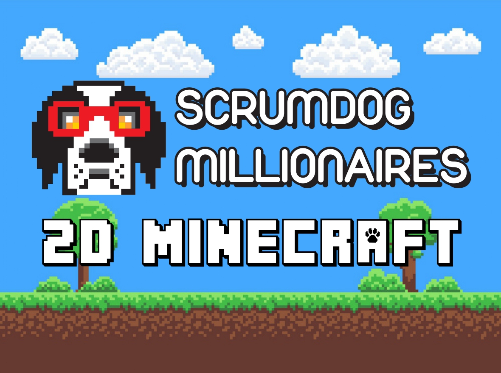

2D Minecraft is a Software Design Project for a client at Wits University. It aims to incorporate as many dynamics as possible from the base 3D Minecraft game into a 2D version coded entirely in Python. 

In this version of Minecraft, one can break blocks, place blocks, craft new items using the crafting table and craft the end-game item.

Instuctions below detail how one can install the 2D Minecraft game. In addition to the base interactive game, one can also install a gym agent which plays the game by itself!

Gym is a Python library which provides a standard API for developing reinforcement learning algorithms. The team used gym to create an agent which takes actions in the minecraft environemnt, receives rewards for the actions it takes and the states it enters and checks to see whether the game has been completed.

One is able to create custom tasks which the agent will have to complete and receive a reward thereafter. 
In addition, you are able to make use of any of the built in tasks that the team has created for you. 

## Group Members
* Justin (scrum master)
* Lior
* Luciano
* Michaela
* Benjamin
* Gavin
* Damion
* Stuart 'Lazarus'
* Jeremy


## Project layout
```
SCRUM-DOG-MILLIONAIRES
│   setup.py    # The configuration file for the package.  
│   MainGym.py  # Gym current setup and runner file
│   main.py     # Main py file for the base interactive game
│
└───Diagrams
│   │   ...     # Diagrams outlining the implementation
│   
│   
└───gym_MC
│   │   __init__.py  # The environment Config
│   │   ...          # Other files required by Gym
│
│  
└───Levels
│   │   ...    # Fallback Levels
│
│
└───Sound Effects
│   │   ...    # Sound Effect Files
│
│
└───Textures
│   │   ...    # Texture Files
│
│
└───Website
│   │   ...     # Website Files
│
│
└───MainGame
│   │   ...      # Interactive Game Files
```

## Packages used
* pygame version: 2.1.2
* numpy version: latest
* perlin-noise version: 1.12
* gym version: 0.26.1


## Installing the package 
In order to install the package locally, please download the latest release (currently version `2.0.0`) from [here](https://github.com/2333263/ScrumDogMillionaires/releases).  
Once downloaded, please extract the file into the desired directory and set it as the actice directoy. 
  
If it is your first time running, please run the following command from the root directory (`/SCRUM-DOG-MILLIONAIRES`) of the project in the terminal:
```py
pip install -r requirements.txt
```
  
Once the requirements are installed, navigate to the appropriate page on the website in order to see instructions on running the interactive game, or running the gym agent. 