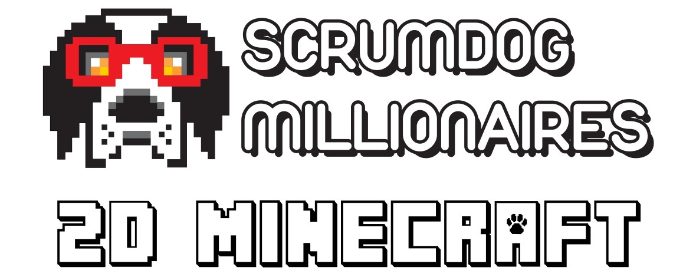

<!---

-->


2D Minecraft is a Software Design Project for a client at Wits University. It aims to incorporate as many dynamics as possible from the base 3D Minecraft game into a 2D version coded entirely in Python. 

In this version of Minecraft, one can break blocks, place blocks, craft new items using the crafting table and craft the end-game item.

Instuctions below detail how one can install the 2D Minecraft game. In addition to the base interactive game, one can also install a gym agent which plays the game by itself!

Gym is a Python library which provides a standard API for developing reinforcement learning algorithms. The team used gym to create an agent which takes actions in the minecraft environemnt, receives rewards for the actions it takes and the states it enters and checks to see whether the game has been completed.

One is able to create custom tasks which the agent will have to complete and receive a reward. 
In addition, you are able to make use of any of the built in tasks that the team has created for you. 


<!--- Add in info about Jim & Michael (our lord and savior) here  -->

## Group Members
* Justin Knopfmacher (scrum master) - 2356115
* Lior Becker - 2333263
* Luciano Meixieira - 2332853
* Michaela Klug - 2393033
* Benjamin Servant - 2420656
* Wen Guan Gavin Chen - 2302891
* Damion Harvey - 2303289
* Stuart Groves - 2356823
* Jeremy Stott - 2368841

## Project layout
```
SCRUM-DOG-MILLIONAIRES
│   setup.py    # The configuration file for the package.  
│   MainGym.py  # Gym current setup and runner file
│
└───Diagrams
│   │   ...     # Diagrams outlining the implementation
│   
│   
└───gym_MC
│   │   __init__.py  # The environment Config
│   │   ...          # Other files required by Gym
│
│  
└───Levels
│   │   ...    # Fallback Levels
│
│
└───Sound Effects
│   │   ...    # Sound Effect Files
│
│
└───Textures
│   │   ...          # Texture Files
│
│
└───Website
│   │   ...          # Website Files
│
│
└───MainGame
│   │   main.py      # Main py file for the base interactive game
│   │   ...          # Website Files
```

## Packages used
* pygame version: 2.1.2
* numpy version: latest
* perlin-noise version: 1.12
* gym version: 0.26.1


## Installing the package 
In order to install the package locally, please run this from your local terminal after setting your current working directory using `cd /directoy/`. Then run the following command.
```python
pip install -e scrumdogmillionaires
```

## Setting up the Gym Agent

```python
pip install -e scrumdogmillionaires
```

## Instructions for the interactive game
