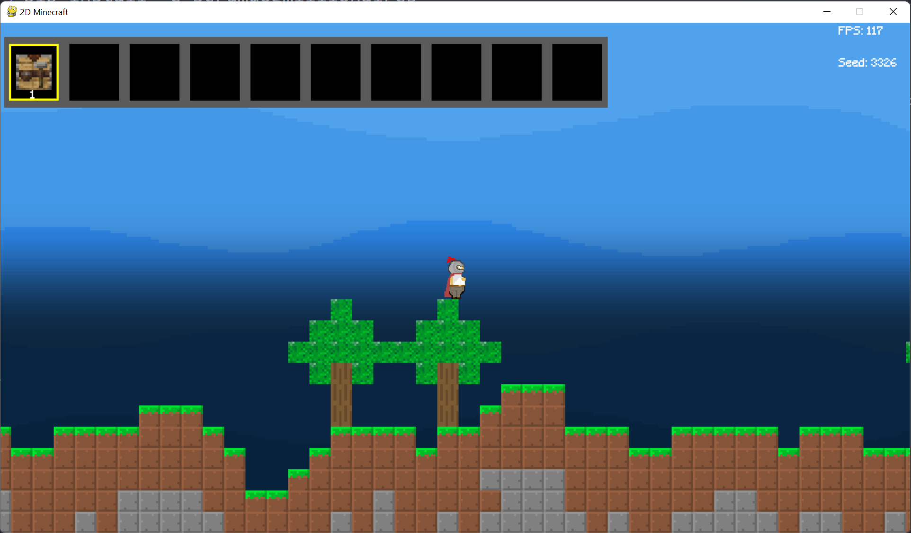

## Playing the Game
In order to play the base interactive game, please run the following command after installing the package, within the games main directory: `/SCRUM-DOG-MILLIONAIRES/`

```python
python3 main.py 
```
Once open, you are greeted with a main start screen. Here you can enter the seed (in the top left). This seed can be an integer value. In the top left, a question mark button is found that gives details on the controls of the game. 
Clicking on play allows you to be moved into the playable game. Please see the screenshots below for a visual of what was explained.

## Demo of the game screens
  


## Instructions for playing


<!--  -->
