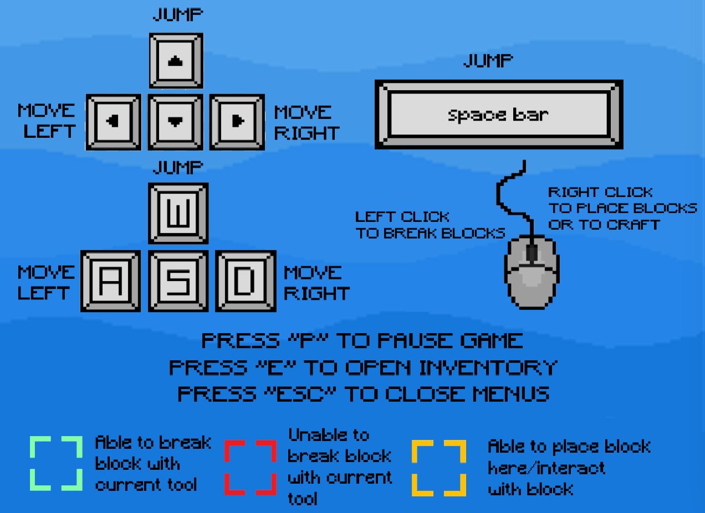

## Playing the Game
In order to play the base interactive game, please run the following command after installing the package, within the games main directory: `/SCRUM-DOG-MILLIONAIRES/`

```py
python3 main.py 
```
Once you open the game, you are greeted with a main start screen. 
Here you can enter the seed in the top left corner. The seed can either be a string or an integer. 
In the top right corner, a question mark button is found. When you click here, details on the controls of the game will appear. 
Clicking on begin game allows you to be moved into the playable game.
Please see the screenshots below for a visual guide. 

## Demo of the game screens
  


## Instructions for playing


## How to craft
In order to craft new blocks and tools, the player will have to be in range of the crafting table and then right click on the crafting table block. One should then drag the blocks from the inventory into the crafting table. If the blocks are positioned in the correct position to craft an item, the question mark will display the item you are able to create. To create the item and add it to your inventory, click on 'craft' which will now be green.
If the blocks are not positioned in an arrangement which corresponds to any craftable item or the player does not have enough blocks, then 'craft' will remain white and the question mark will still be displayed.

### Breaking Blocks
Each block has a different hardness and some require stronger tools in order to be broken. 

#### Blocks that can be broken with hands:
- dirt
- grass
- wooden logs
- leaves

#### Blocks that can be broken with a wooden pickaxe:
- all blocks that can be broken with hands
- stone

#### Blocks that can be broken with stone pickaxe:
- all blocks that can be broken with hands
- all blocks that can be broken with wooden pickaxe
- diamond
- gold
- emerald
- iron
 
### Craftable items
<figure>
    <div style="float:left" >
      
      <figcaption style="word-wrap: break-word; inline-size: 190px; " >1 wooden log crafts 4 wooden planks</figcaption>
    </div>
    <space>
    <div style="float:left" >
        
        <figcaption style="word-wrap: break-word; inline-size: 190px; ">5 wooden planks crafts 1 wooden pickaxe</figcaption>
    </div>
    <space>
    <div style="float:left" >
       
       <figcaption style="word-wrap: break-word; inline-size: 190px; ">3 stones and 2 wooden planks crafts 1 stone pickaxe</figcaption>
    </div>
</figure>

<figure>
    <div style="float:left" >
      
      <figcaption style="word-wrap: break-word; inline-size: 190px; " >1 gold ore crafts 1 gold ingot</figcaption>
    </div>
    <space>
    <div style="float:left" >
        
        <figcaption style="word-wrap: break-word; inline-size: 190px; ">1 diamond ore crafts 1 diamond</figcaption>
    </div>
    <space>
    <div style="float:left" >
       
       <figcaption style="word-wrap: break-word; inline-size: 190px; ">1 emerald ore crafts 1 emerald</figcaption>
    </div>
</figure>

<figure>
    <div style="float:left" >
      
      <figcaption style="word-wrap: break-word; inline-size: 190px; " >9 diamonds crafts 1 diamond block</figcaption>
    </div>
    <space>
    <div style="float:left" >
        
        <figcaption style="word-wrap: break-word; inline-size: 190px; ">9 gold ingots crafts 1 gold block</figcaption>
    </div>
    <space>
    <div style="float:left" >
       
       <figcaption style="word-wrap: break-word; inline-size: 190px; ">4 gold blocks, 4 diamond blocks and 1 emerald crafts 1 end game block</figcaption>
    </div>
</figure>